# WanderLust - MERN + Jenkins + Docker + SonarQube

Travel blog platform (React + Node/TS + MongoDB + Redis) deployed via Jenkins CI/CD to AWS EC2 Docker host.

## Introduction
This document presents a technical overview of an automated Continuous Integration/Continuous Deployment (CI/CD) pipeline implemented. The objective was to architect and implement an automated deployment workflow triggered by source code changes, ensuring that the application passes quality checks, is containerized, and is deployed without manual intervention. This project demonstrates a minimal yet complete CI/CD pipeline deployed on a cloud infrastructure using key DevSecOps tools.

## Sources
 - Wanderlust project by Krishna Acharya :[GitHub Repository](https://github.com/krishnaacharyaa/wanderlust)

## Process
1. Fork the repository in our own Repository and cloned it into the local.
2. Create 3 AWS EC2 instances with 15GB EBS.
3.Instance-1 : install java, jenkins and docker
-  Instance-2 : install java, sonarqube
-   Instance-3 : install docker

   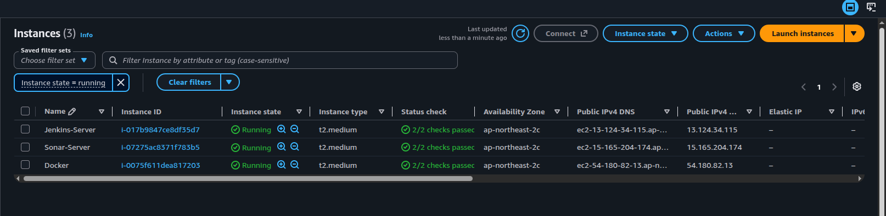

## Installation

*   **Java (JDK 17+ for Jenkins/Sonar):** https://adoptium.net/temurin/releases/ or https://jdk.java.net/
*   **Jenkins:** https://www.jenkins.io/download/ - Docs: https://www.jenkins.io/doc/book/installing/linux/
*   **Docker:** https://docs.docker.com/engine/install/ - Desktop: https://www.docker.com/get-started/
*   **SonarQube:** https://www.sonarsource.com/products/sonarqube/downloads/ - Docs: https://docs.sonarsource.com/sonarqube/latest/setup-and-upgrade/install-the-server/

## System Architecture

  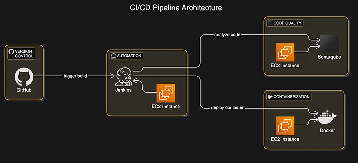
  
 __The setup includes three EC2 instances, each assigned a specific DevSecOps role. GitHub triggers a webhook upon a push event, which notifies Jenkins to start the pipeline.__

 *   __Github__: Triggers the Jenkins pipeline using a webhook.
 *   __Jenkins__: Clones the repo, runs SonarQube analysis, builds the Docker image, and deploys the container.
 *   __SonarQube__: Analyzes source code quality.
 *   __DockerHost__: Receives the Docker image and runs the web application container.

## Infrastructure Setup

### Jenkins Setup
* Launched an Ubuntu-based EC2 instance with t2.medium, volume size - 15GB.
* Opened port 8080,22,443,80 in Security Groups.
* Installed Java and Jenkins and docker, Jenkins require Java to run.
* Added Jenkins to Docker group to enable the administrative priviledge.

  ` sudo usermod -aG docker jenkins && newgrp docker `

### SonarQube Setup 
* Launched an EC2 instance t2.medium .
* Opened port 9000,22,443 in Security Groups.
* Installed Java and SonarQube, Sonarqube require Java to run.

### Docker Setup
* Launched an EC2 instance t2.medium .
* Opened port 8080,5173,22,443,8000 in Security Groups.
* Installed Docker.

__No Elastic IPs are used — the GitHub webhook URL and SonarQube server URL are updated manually after each EC2 stop/start cycle.__

### Security Group settings for inbound rules

  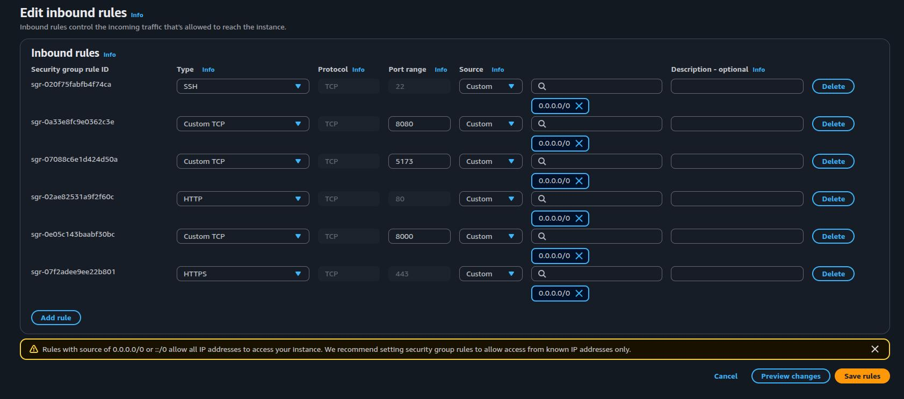

## CI/CD Pipeline Workflow

### Trigger Mechanism
A webhook is configured in GitHub to notify Jenkins of push or pull request events. This ensures immediate execution of the pipeline upon code changes.

## Pipeline Stages

## Pipeline Stages

1. **Checkout** — pulls the latest commit from GitHub using Jenkins SCM configuration.
2. **Setup .env Files** — copies `backend/.env.sample` → `backend/.env` and `frontend/.env.sample` → `frontend/.env`.
3. **Install Dependencies** — runs `npm run installer` to install root, backend, and frontend dependencies.
4. **Run Tests & Generate Coverage** — runs backend tests with **Jest** and frontend tests with **Vitest**, generating LCOV coverage reports:
   - `backend/coverage/lcov.info`
   - `frontend/coverage/lcov.info`
5. **SonarQube Analysis** — runs the official SonarScanner CLI through Jenkins' `tool 'sonar-scanner'`, analyzing JavaScript/TypeScript code and importing frontend/backend LCOV coverage reports.
6. **Quality Gate** — waits for the SonarQube Quality Gate with a 5-minute timeout. `abortPipeline: false` allows the pipeline to continue even if the Quality Gate reports an error.
7. **OWASP Dependency Check** — scans project dependencies for known CVEs using the NVD database and stores the vulnerability database in `$HOME/.dependency-check-data`. Generates HTML/XML reports and publishes the XML report when available.
8. **Build Images** — runs `docker compose build` on the Jenkins agent.
9. **Deploy to Docker Host** — SSHes into ec2-3 using the `docker-ssh-key` credential, pulls the latest `main` branch, and runs:
   `docker compose up -d --build --remove-orphans`
10. **Database Verification & Seeding** — checks the MongoDB `wanderlust.posts` collection. If no posts exist, imports sample data from `backend/data/sample_posts.json`.
11. **Redis Cache Reset** — after sample data is imported, Redis is cleared with `FLUSHALL` and the backend container is restarted so the application can load the updated data.

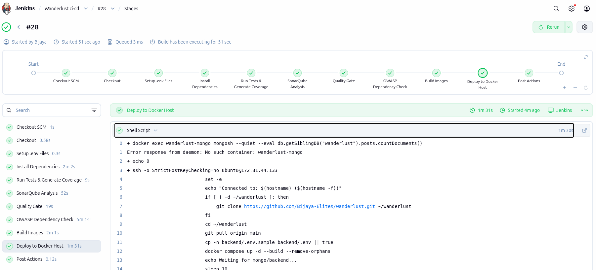

## Testing & Coverage

### Backend

- **Jest**
- LCOV coverage report
- `backend/coverage/lcov.info`

### Frontend

- **Vitest**
- LCOV coverage report
- `frontend/coverage/lcov.info`

Coverage reports are supplied to SonarQube during static code analysis.

## Trigger

GitHub webhook (`GitHub hook trigger for GITScm polling`) fires a build on every push to `main`. Requires the webhook payload URL to match ec2-1's current public IP.

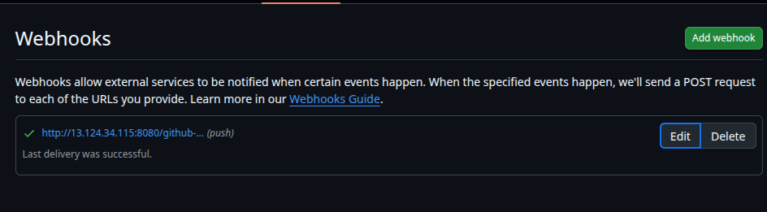

# Jenkins Credentials Used

| ID | Purpose |
|---|---|
| `repo-pat` | Git checkout |
| `github-pat` | GitHub API access |
| `sonar-token` | SonarQube auth |
| `nvd-api` | NVD API key for OWASP scan |
| `docker-host-ssh` | SSH deploy to ec2-3 |

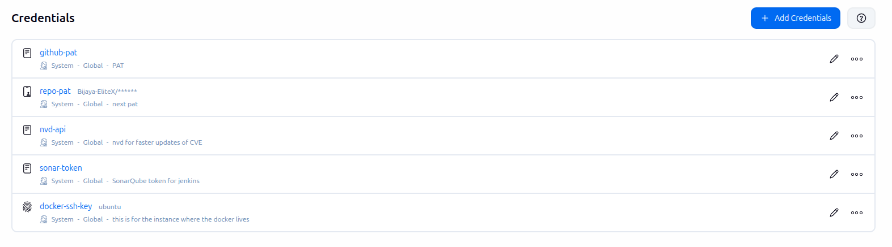

## Jenkins Configuration via UI

1. **Create New Job:** Open Jenkins Dashboard → “New Item” → Enter job name → Choose “Pipeline” → Click OK.

2. **Pipeline Configuration:** Under “Pipeline,” select **Pipeline script from SCM** and configure:
   - SCM: Git
   - Repository URL: `https://github.com/Bijaya-EliteX/wanderlust.git`
   - Branch: `main`
   - Script Path: `Jenkinsfile`

3. **Build Triggers:** Enable **“GitHub hook trigger for GITScm polling”** to trigger the pipeline automatically whenever changes are pushed to GitHub.

4. **Jenkins Tools:** Configure the required tools and integrations:
   - SonarQube Scanner: `sonar-scanner`
   - SonarQube Server: `sonar-server`
   - OWASP Dependency-Check: `OWASP-DC`

5. **Jenkins Credentials:** Configure the required credentials:
   - `nvd-api` — NVD API key for OWASP Dependency-Check
   - `docker-ssh-key` — SSH key used to connect to the Docker EC2 host

## Observation and Output
* __SonarQube Results__: Code coverage, code smells, duplications(3.8% duplications)

  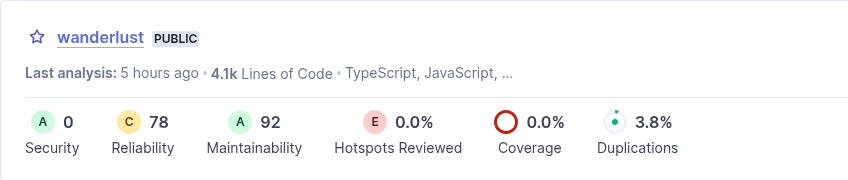

* __docker Logs__: 
- Frontend UI: http://<PUBLIC_IP>:5173 (5173:80 nginx)

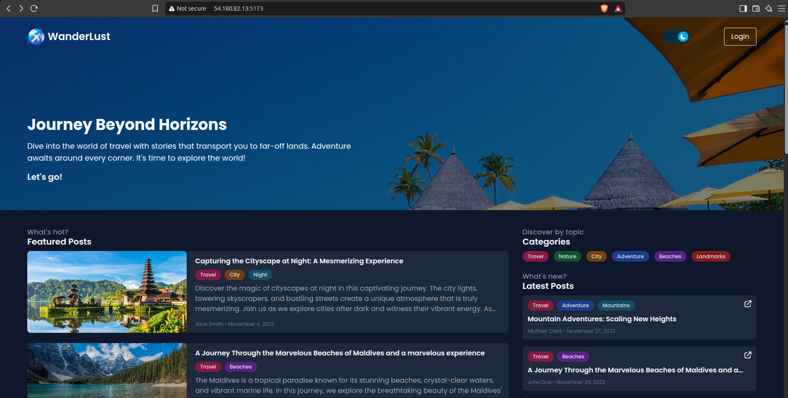
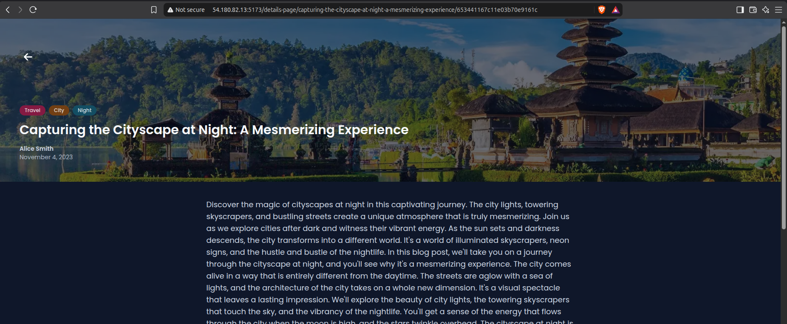
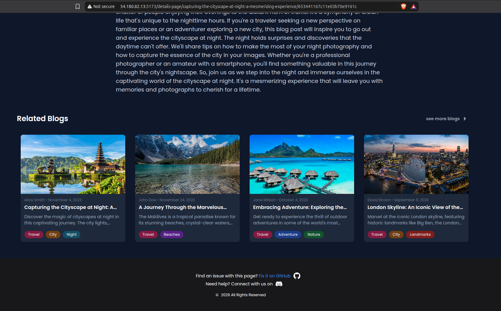

- Backend API direct: http://<PUBLIC_IP>:8080/api/posts (8080:8080)

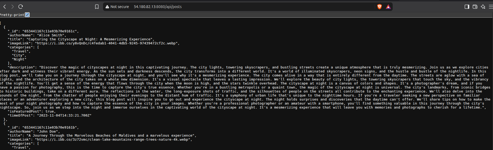

- Reverse proxy (nginx frontend/nginx.conf:13 proxy_pass http://backend:8080): http://<PUBLIC_IP>:5173/api/posts/latest -> same as 8080 but via 5173

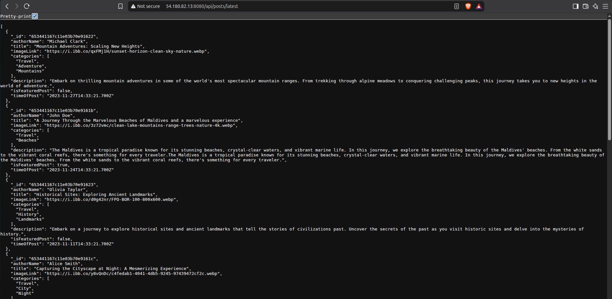

## Known Issues / Gotchas

- **Scanner version matters**: the official SonarScanner CLI must be version-compatible with the SonarQube server (10.4.1). A too-old (`npx sonar-scanner` npm package) or too-new CLI both fail with `"report" parameter is missing` on upload.
- **IP drift**: stopping/starting any instance (not just service restarts) changes its public IP, breaking the webhook and inter-instance SSH/URLs until manually updated.
